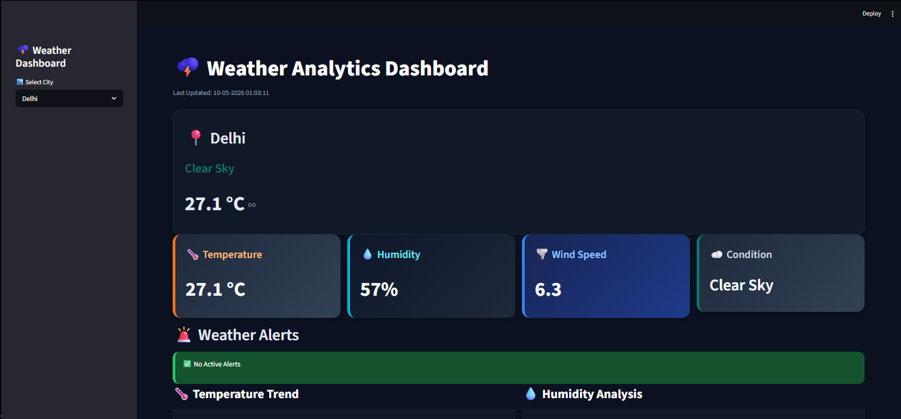
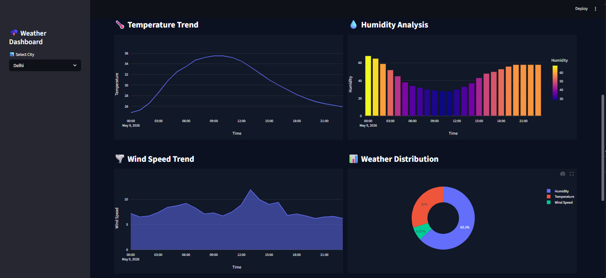

# 🌦️ Weather Forecast Analytics Dashboard

##  Objective

The objective of this project is to build a professional weather analytics dashboard that provides real-time weather forecasting, interactive visualizations, and detailed weather insights using Python and Streamlit.

##  Features

• Real-time weather forecasting
• City-based weather search
• Temperature, humidity, and wind analysis
• Interactive Plotly visualizations
• Multi-day weather forecast
• Weather alert system
• Responsive and professional UI
• API-based live weather data
• Dynamic analytics dashboard
• Lightweight and fast performance

📂 Project Structure

WEATHER_FORECAST_&_ALERT_APP/
│
├── dashboard/
│   └── app.py                    
│
├── data/                          
│
├── images/                        
│
├── outputs/                    
│   ├── Delhi_chart.png
│   ├── Lucknow_chart.png
│   ├── Mumbai_chart.png
│   └── Pune_chart.png
│
├── reports/                      
│    
│
├── src/                            
│   ├── __init__.py                
│   ├── alerts.py              
│   ├── config.py                
│   ├── parser.py                  
│   ├── report_generator.py       
│   ├── simulation/                
│   ├── utils.py                  
│   ├── visualization.py           
│   └── weather_api.py             
│
├── .gitignore                    
├── main.py                        
├── README.md                  
└── requirements.txt               

##  Tech Stack

| Technology | Purpose |
|---|---|
| Python | Core programming language used for application development |
| Streamlit | Building the interactive web dashboard |
| Plotly Express | Creating interactive charts and visualizations |
| Plotly Graph Objects | Advanced custom data visualizations |
| Pandas | Data processing and analysis |
| Requests | Fetching real-time weather data from APIs |

##  Installation

### 1. Clone the Repository

git clone https://github.com/Nikhatjahan85/weather-forecast-dashboard.git

### 2. Navigate to the Project Directory

cd weather-forecast-dashboard

### 3. Create Virtual Environment

python -m venv venv
venv\Scripts\activate

### 4. Install Dependencies

pip install -r requirements.txt

## ▶️ How to Run

### Run the Application

python main.py

### Run Dashboard

streamlit run main.py

## 📊 Dashboard Highlights

| Feature | Description |
|---|---|
| Weather Cards | Displays live weather metrics |
| Forecast Analytics | Interactive weather trend analysis |
| Alert System | Color-coded weather alerts |
| Visualizations | Dynamic Plotly charts |
| Responsive UI | Optimized professional layout |

##   Dashboard Preview

## 🔮 Future Improvements

• AI-based weather prediction
• Historical weather analytics
• Auto-location detection
• Dark and Light theme support
• Advanced forecasting models
• Weather news integration
• Severe weather alert prediction
• Machine learning-based climate analysis

## 📜 License

This project is licensed under the MIT License.

## 👨‍💻 Author

Nikhat Jahan
